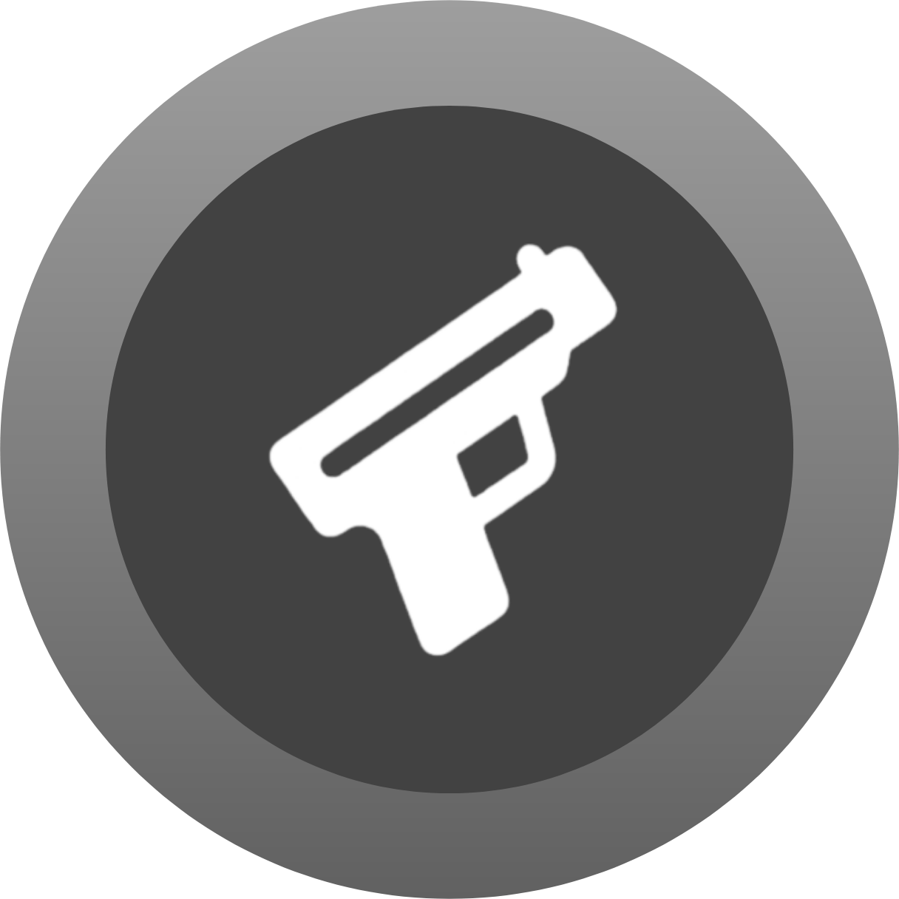

#  opengunslol

This prject is a fully open source website inspired by [guns.lol](https://guns.lol), [ezbio](https://e-z.bio/) and [linktree](https://linktr.ee/)

## Features

| Feature | Status |
|---|---|
| Custom colors | ✅ |
| Custom text | ✅ |
| Custom social icons | ✅ |
| Corner radius control | ✅ |
| Custom background | ✅ |
| Music player with tracks and covers | ✅ |
| Username and background effects | ✅ |
| Volume control | ✅ |
| Custom cursor | ✅ |
| Views system | ❌ |

---

[Live Preview](https://glockfatherdraco.github.io/opengunslol/)
